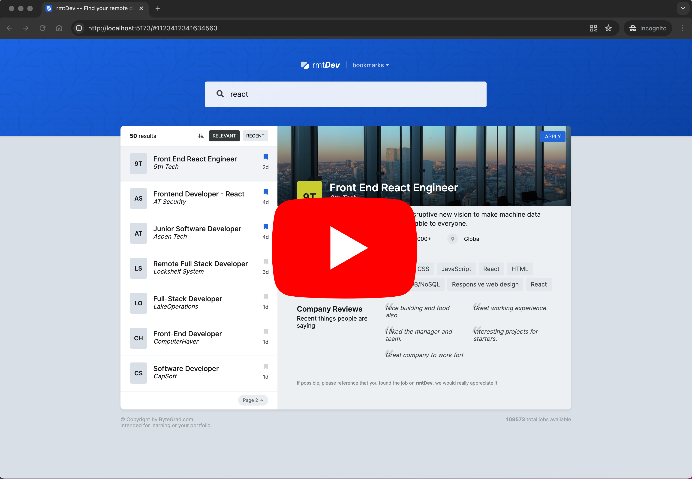

# Remote Dev Web Application

## Overview

This application is designed specifically for developers who work remotely and are looking for job opportunities anywhere in the world. With our user-friendly interface, you can easily search for remote job openings, sort them by relevance or recent postings, bookmark your favorite jobs, and get detailed job descriptions and salary information.

[](https://youtu.be/pMbCnkourL4)

_(Right-click and select "Open link in new tab" to watch the video in a new tab.)_

## Features

This application is designed specifically for developers who work remotely and are looking for job opportunities anywhere in the world. With our user-friendly interface, you can easily search for remote job openings, sort them by relevance or recent postings, bookmark your favorite jobs, and get detailed job descriptions and salary information.

- **Search Input Field**: Quickly find remote job opportunities by entering keywords, job titles, or companies.
- **Job Cards**: View a list of job postings presented as cards, each containing key information about the job.
- **Sort Options**: Sort job listings by relevance or recent postings to find the most suitable opportunities.
- **Bookmark Jobs**: Save jobs that interest you for easy access later.
- **Job Overview**: Click on job cards to get an overview of the job description, salary, and other important details.
- **Caching**: Enjoy faster load times and improved performance with optimized caching system, which stores frequently accessed data locally.

## Getting Started

Before you begin, ensure you have the latest version of Node.js installed. This project uses Node.js 20.x or later.

### Installation

1. Clone the repository

   ```sh
   git clone https://github.com/vmalchik/rmt-dev.git
   cd rmt-dev
   ```

2. Install dependencies

   ```sh
   npm install
   # or
   yarn install
   ```

### Running the Application

To start the development server, run:

```sh
npm run dev
# or
yarn dev
```

Open your browser and navigate to http://localhost:5173/ to see the application in action.

### Building for Production

```sh
npm run build
# or
yarn build
```
